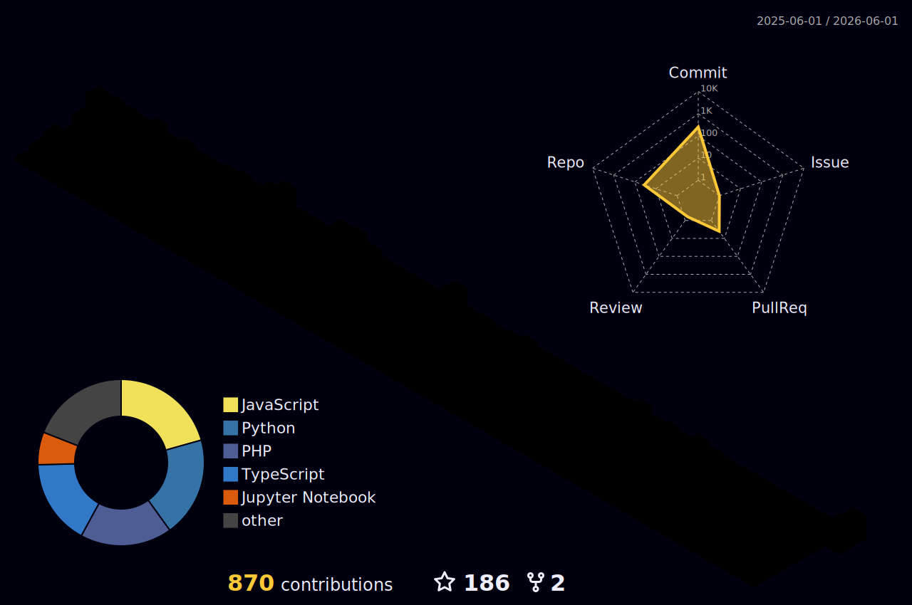

  <!-- Coding GIF -->
  

<h1 align="center">Hi 👋, I'm Faith Mutua</h1>

  

I am a passionate software developer and AI/ML enthusiast from Kenya, driven by curiosity and creativity. What began as simple HTML experiments grew into a love for building interactive user experiences with JavaScript and React. Over time, I’ve expanded into broader software development, constantly learning and refining my skills. I’m particularly interested in artificial intelligence and machine learning, exploring how intelligent systems can solve real-world problems. Recently, I’ve also been experimenting with 3D design in Blender, and every late-night debugging session and “it works!” moment continues to shape me as a developer.

### 👨‍💻 Quick Facts

- 👀 Interested in learning new web technologies, creating visually appealing web interfaces, and exploring 3D design and game development  
- 🌱 Currently learning *Machine Learning*, improving *web-dev skills*, and diving into *Blender* and *Unity*  
- 🔍 Open to collaborating on web development and 3D projects   
- 📫 Reach me at: *charlesfaith157@gmail.com*  
- ⚡ Fun fact: *Dark theme all day, every day 😎*

> 

>   

>     "Your code sparkles like stardust, lighting up the tech world with grace and grit!"
>   

> 

 

### 🛠️ Languages & Tools

<h2 align="left">🚀 Tech Stack</h2>

<h3 align="left">💻 Languages</h3>
<table>
  <tr>
    <td></td>
    <td></td>
    <td></td>
    <td></td>
  </tr>
</table>

---

<h3 align="left">🌐 Frontend</h3>
<table>
  <tr>
    <td></td>
    <td></td>
    <td></td>
  </tr>
</table>

---

<h3 align="left">📱 Mobile Development</h3>
<table>
  <tr>
    <td>
      
    </td>
    <td>
      
    </td>
  </tr>
</table>

---

<h3 align="left">⚙️ Backend</h3>
<table>
  <tr>
    <td></td>
    <td></td>
  </tr>
</table>

---

<h3 align="left">🗄️ Database</h3>
<table>
  <tr>
    <td></td>
    <td></td>
  </tr>
</table>

---

<h3 align="left">🛠️ Tools</h3>
<table>
  <tr>
    <td></td>
    <td></td>
    <td></td>
    <td></td>
    <td></td>
  </tr>
</table>

 

 ## My GitHub Activity in 3D (Night Rainbow Style)

  
## 🐍 My GitHub Contributions Snake

<!-- For dark/light theme switching -->
<picture>
  <source media="(prefers-color-scheme: dark)" srcset="https://github.com/FaithMutua-code/FaithMutua-code/blob/output/github-snake-dark.svg">
  <source media="(prefers-color-scheme: light)" srcset="https://github.com/FaithMutua-code/FaithMutua-code/blob/output/github-snake.svg">
  
</picture>

<h2 align="center">👽 Where to find me 👽</h2>
 
<!-- https://icons8.com -->

 
  
  
  

  Thanks for visiting my profile! 😊 
  I'm always excited to connect, collaborate, and grow together with fellow developers.  
  Keep coding, keep dreaming — the best is yet to come! 🚀

