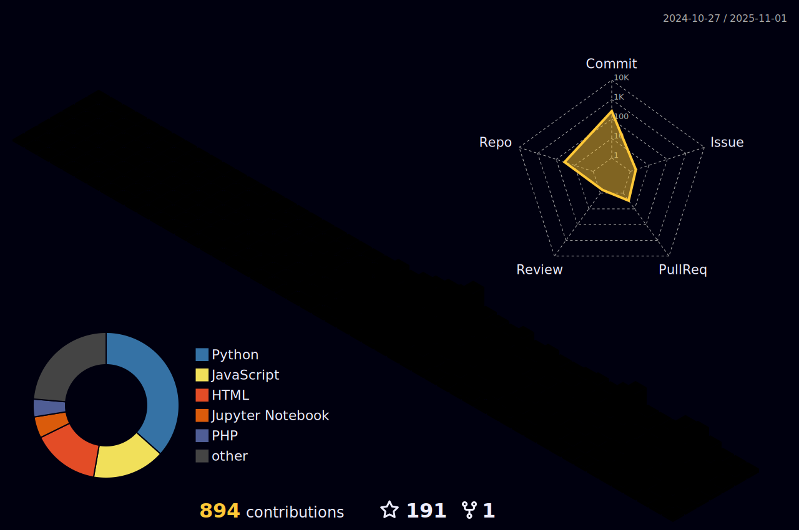

  <!-- Coding GIF -->
  

<h1 align="center">Hi 👋, I'm Faith Mutua</h1>

  

I am a passionate web developer from Kenya. My coding journey began with a spark of curiosity and a passion for creativity. What started as simple HTML experiments quickly grew into a full-blown love for building interactive user experiences with JavaScript and React. Over time, I’ve immersed myself in the world of web development, constantly learning and pushing myself to master new tools and technologies. Recently, I've been exploring 3D design with Blender, experimenting with simple models, and diving into game development and interactive design with Unity Engine. From late-night debugging sessions to that first "it works!" moment — every step has shaped the developer I am today.

### 👨‍💻 Quick Facts

- 👀 Interested in learning new web technologies, creating visually appealing web interfaces, and exploring 3D design and game development  
- 🌱 Currently learning *Python*, improving *web-dev skills*, and diving into *Blender* and *Unity*  
- 🔍 Open to collaborating on web development and 3D projects   
- 📫 Reach me at: *charlesfaith157@gmail.com*  
- ⚡ Fun fact: *Dark theme all day, every day 😎*

> 

>   

>     "Your code sparkles like stardust, lighting up the tech world with grace and grit!"
>   

> 

 

### 🛠️ Languages & Tools

  
  
  
  
  
  
  
  
  
  
  
  
  
  
  
  
  
  
  
  

## 🚀 My GitHub Activity in 3D (Night Rainbow Style)

  
## 🐍 My GitHub Contributions Snake

<!-- For dark/light theme switching -->
<picture>
  <source media="(prefers-color-scheme: dark)" srcset="https://github.com/FaithMutua-code/FaithMutua-code/blob/output/github-snake-dark.svg">
  <source media="(prefers-color-scheme: light)" srcset="https://github.com/FaithMutua-code/FaithMutua-code/blob/output/github-snake.svg">
  
</picture>

<h2 align="center">👽 Where to find me 👽</h2>
 
<!-- https://icons8.com -->

 
  
  
  

  Thanks for visiting my profile! 😊 
  I'm always excited to connect, collaborate, and grow together with fellow developers.  
  Keep coding, keep dreaming — the best is yet to come! 🚀

